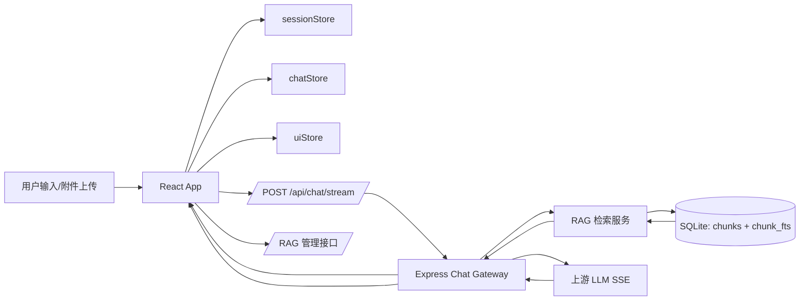
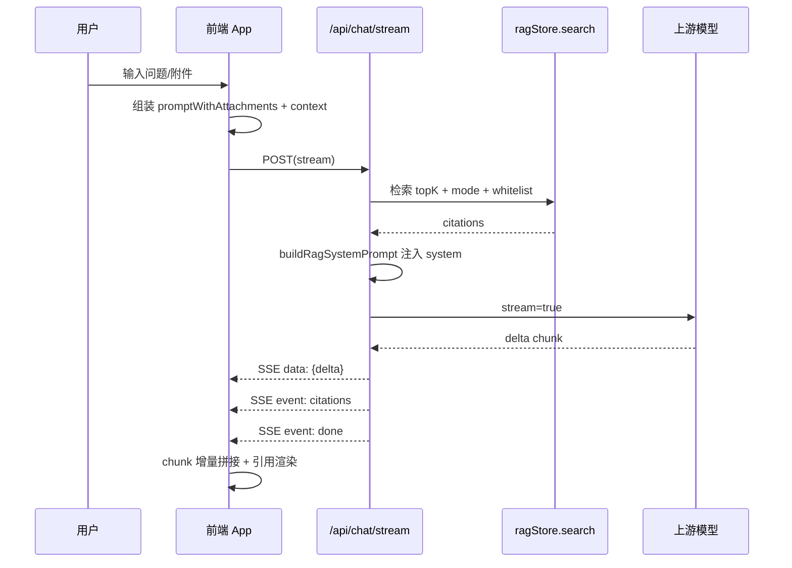

# AI Chat Platform 全面技术解析（答辩/面试版）

## 0. 项目定位与演进主线

本项目是一个 React 19 + Vite + Node.js/Express 的智能对话系统，目标并非“能聊就行”，而是把真实业务里最容易失控的三件事做稳：

1. 实时交互体验：长回答必须可流式、可中断、可恢复。
2. 事实性与可解释：回答不仅要“像对的”，还要能给出可检查的引用依据。
3. 可维护工程结构：会话、消息、UI、知识库、上传链路在复杂交互下不互相污染。

系统能力围绕一条演进路线落地：

- 第 1 阶段：先打通 SSE 流式主链路，保障“可实时反馈”。
- 第 2 阶段：接入文档解析与 RAG，保障“可基于资料回答”。
- 第 3 阶段：补齐引用透明、虚拟滚动和状态分层，保障“可解释 + 可持续迭代”。

---

## 1. 架构全景图

### 1.1 设计思路

系统采用前后端分层架构，核心是“交互层快响应、检索层可约束、存储层轻运维”：

- 前端负责会话编排、流式拼接、引用展示与多状态协同。
- 后端负责模型转发、RAG 检索、文档入库与协议整形。
- 存储使用 SQLite（FTS5 + 向量 JSON），降低本地部署与运维复杂度。

### 1.2 技术决策

- 前端：React 19 + Zustand + react-window
  - 组件渲染与交互响应分离，状态按域切分。
- 后端：Express + SSE 转发 + eventsource-parser
  - 统一上游模型差异，前端只消费统一 SSE 协议。
- 检索：FTS5 + 向量混检
  - 关键词兜底精确命中，向量提高语义召回。
- 存储：better-sqlite3
  - 文件级部署，WAL 支持并发读写，适合单机/轻服务场景。

代码锚点：

- 依赖栈定义：server/package.json 第 13 行、第 16 行、第 18 行、第 20 行
- 前端核心依赖：package.json 第 21 行、第 22 行、第 23 行、第 25 行
- RAG 表结构初始化：server/src/ragStore.js 第 252 行

### 1.3 前后端分层架构（Mermaid）



### 1.4 数据流向：输入到回答的全链路（Mermaid）



### 1.5 状态管理边界：为何拆分三类 Store

设计原则是“生命周期与读写频率分离”：

- sessionStore：会话元数据（标题、模型、answerMode、activeId）
  - 更新低频、对列表 UI 影响大。
- chatStore：消息主数据与流式状态（messagesBySession、streaming/paused）
  - 高频更新，且必须会话隔离。
- uiStore：页面路由、输入框、上传任务、知识库选择
  - 交互态强，适合最小持久化。

代码锚点：

- chatStore 结构与持久化：src/store/chatStore.ts 第 7 行、第 150 行
- sessionStore merge/partialize：src/store/sessionStore.ts 第 106 行、第 122 行
- uiStore retrieval 与 uploads：src/store/uiStore.ts 第 11 行、第 40 行、第 70 行

### 1.6 踩坑经验

1. 把所有状态塞进单 store 会导致流式更新频繁触发全局订阅，长对话下明显卡顿。
2. Map 直接持久化会丢结构；必须显式做 Object/Map 双向转换。
3. 上传态不应放进消息 store，否则会和消息撤销、重生成发生交叉污染。

### 面试考点提示

- 为什么消息状态高频更新必须独立于会话元数据？
- Map 持久化如何保证序列化一致性？
- 如果要支持“多标签页同步会话”，store 边界怎么演进？

---

## 2. SSE 流式链路详解

### 2.1 设计思路

链路目标不是“能流式”，而是“可控流式”：

- 可控中断：暂停时可停止网络流。
- 可控恢复：继续时能从局部上下文续写。
- 可控重试：失败可重生回答，不污染历史消息。

### 2.2 EventSource vs fetch ReadableStream 选型

最终选择 fetch + ReadableStream（前端）而不是原生 EventSource，主要因三点：

1. 需要 POST 传 body（sessionId、messages、mode、attachmentDocIds）。
2. 需要携带可配置认证头。
3. 需要 AbortController 主动中断，适配暂停/重生。

代码锚点：

- 前端 fetch SSE 启动：src/services/chatStream.ts 第 103 行、第 203 行
- AbortController：src/services/chatStream.ts 第 133 行
- 事件分发与 done 去重：src/services/chatStream.ts 第 147 行、第 155 行

关键代码片段（src/services/chatStream.ts 第 133-215 行）：

```ts
const controller = new AbortController()
let doneNotified = false

const notifyDone = () => {
  if (doneNotified) return
  doneNotified = true
  onDone()
}

const response = await fetch(url.toString(), {
  method: 'POST',
  headers,
  body: JSON.stringify({ sessionId, prompt, model, messages }),
  signal: controller.signal,
})
```

### 2.3 chunk 增量渲染与“打字机效果”竞态处理

当前实现是 chunk 级增量拼接 + 正在生成指示器，而非逐字符定时器：

- 收到 chunk 即 append 到目标 assistant 消息。
- 通过 doneNotified 防止 done 事件重复收敛。
- 同会话仅保留一条流式连接，先关旧流再开新流，避免并发写入同一消息。

代码锚点：

- parseData 与多事件兼容：src/services/chatStream.ts 第 58 行
- onChunk 写入：src/App.tsx 第 130 行、第 171 行
- 单会话单连接：src/App.tsx 第 171 行
- 消息增量追加：src/store/chatStore.ts 第 52 行、第 77 行

关键代码片段（src/App.tsx 第 171 行、src/store/chatStore.ts 第 77-95 行）：

```ts
streamClosersRef.current.get(sessionId)?.()

appendToMessageById: (sessionId, messageId, chunk) => {
  set((state) => {
    const next = new Map(state.messagesBySession)
    const list = [...(next.get(sessionId) ?? [])]
    const index = list.findIndex((message) => message.id === messageId)
    if (index === -1) return state
    list[index] = { ...list[index], content: `${list[index].content}${chunk}` }
    next.set(sessionId, list)
    return { messagesBySession: next }
  })
}
```

标准实现范式建议（若要升级为逐字打字机）：

1. 网络层维持 chunk 缓冲队列。
2. 渲染层用 requestAnimationFrame/定时器按字符出队。
3. done 到达后先清空队列再置完成态，避免“未刷完就 done”。

### 2.4 暂停/继续/重新生成状态机

状态集合：Idle / Streaming / Paused / Done。

状态迁移：

- Send -> Streaming
- Pause -> Paused（关闭连接，保留 task meta）
- Resume -> Streaming（基于 partial + resumePrompt 续写同一 assistantId）
- Regenerate -> Streaming（删除旧 assistant，基于原 prompt 重跑）

代码锚点：

- 任务元信息与连接句柄：src/App.tsx 第 37 行、第 38 行
- Pause：src/App.tsx 第 239 行
- Resume：src/App.tsx 第 263 行
- Regenerate：src/App.tsx 第 304 行
- 流式状态字段：src/store/chatStore.ts 第 8 行、第 9 行

### 2.5 异常回退机制

回退分三层：

1. 网络层：fetch 异常、body 为空、HTTP 非 2xx，统一 onError 回调。
2. 业务层：将错误信息落到当前 assistant 消息，避免“无响应黑洞”。
3. 服务端：上游异常写 SSE error 并 close，保持协议一致。

代码锚点：

- 前端错误收敛：src/services/chatStream.ts 第 224 行、第 267 行
- App 错误落盘：src/App.tsx 第 221 行
- 服务端 writeSse/error：server/src/index.js 第 400 行、第 750 行、第 756 行

### 2.6 踩坑经验

1. 只监听 req.close 会导致 POST 场景提前中断；本项目改为 req.aborted + res.close。
2. done 事件可能来自多路径（解析器结束、流结束），必须做幂等通知。
3. Pause 后若直接续写原 prompt，容易重复内容；需要注入“从尾部继续”的 resumePrompt。

### 面试考点提示

- 为什么 EventSource 不适合本项目？
- done 事件重复触发如何治理？
- Pause/Resume 若跨页面刷新，状态机如何持久化？

---

## 3. RAG 系统实现内幕

### 3.1 设计思路

RAG 的核心不是“检索到内容”，而是“回答约束 + 可解释引用”：

- 文档入库时尽量保证可检索（即使 embedding 临时失败也允许入库）。
- 检索时按模式切换阈值，兼顾准确性和可用性。
- 输出时把 citations 独立事件下发，前端可视化透明展示。

### 3.2 文档解析流水线

后端入库路径：上传 -> 文本提取 -> 语义近邻分块 -> 逐块 embedding -> chunks + FTS 入库。

代码锚点：

- 上传解析入口：server/src/index.js 第 123 行
- PDF 提取（pdf-parse v2）：server/src/index.js 第 109 行
- DOCX 提取（mammoth）：server/src/index.js 第 161 行
- 入库主流程：server/src/ragStore.js 第 438 行
- 分块函数：server/src/ragStore.js 第 124 行

关键代码片段（server/src/ragStore.js 第 444-456 行）：

```js
const chunks = splitTextIntoChunks(plainText)
if (chunks.length === 0) {
  throw new Error('文档解析后为空，无法入库。')
}

const vectors = []
for (const chunk of chunks) {
  try {
    const vector = await embedText(chunk)
    vectors.push(Array.isArray(vector) && vector.length > 0 ? vector : null)
  } catch {
    vectors.push(null)
  }
}
```

分块策略现状：

- 当前实现是“句边界 + chunkSize + overlap”混合策略。
- 对中文标点与换行做语句切分，再做窗口拼接。

标准实现范式建议（扩展方向）：

1. 固定长度：实现简单，召回稳但语义边界粗糙。
2. 递归分块：标题/段落优先，超长再细分。
3. 语义切割：按 embedding 断点切分，成本高但语义完整度最佳。

### 3.3 存储层：SQLite FTS5 + 向量表结构

表设计：

- documents 管理文档元数据与启停态。
- chunks 保存分块正文与 vector_json。
- chunk_fts 提供 FTS5 全文索引（source/content）。

代码锚点：

- 建表与 FTS5：server/src/ragStore.js 第 252 行
- 向量字段：server/src/ragStore.js 第 245 行
- 向量提供器：server/src/embeddingClient.js 第 30 行

为何选 SQLite 而非 Postgres/pgvector：

1. 本项目是本地化/轻部署优先，单文件数据库更适合快速落地。
2. FTS5 原生可用，无需额外服务。
3. 读多写少场景配合 WAL 成本低。
4. 当前规模下，工程复杂度收益比高于引入分布式向量库。

### 3.4 混合检索算法与动态阈值

得分融合：

- vector-only：score = vectorScore
- hybrid：score = 0.72 * vectorScore + 0.28 * keywordScore

动态阈值：

- strict: minScore = 0.7
- balanced: minScore = 0.4
- general/off: 跳过检索

代码锚点：

- search 主函数：server/src/ragStore.js 第 516 行
- minScore 策略：server/src/ragStore.js 第 523 行
- 融合权重：server/src/ragStore.js 第 687 行
- 分数过滤：server/src/ragStore.js 第 698 行
- balanced + whitelist 兜底：server/src/ragStore.js 第 704 行

关键代码片段（server/src/ragStore.js 第 523-698 行）：

```js
const minScore =
  normalizedMode === 'strict'
    ? 0.7
    : normalizedMode === 'balanced'
      ? 0.4
      : 0

const score =
  isVectorOnly
    ? item.vectorScore
    : item.vectorScore * 0.72 + item.keywordScore * 0.28

return ranked
  .filter((item) => item.score >= minScore)
  .sort((a, b) => b.score - a.score)
  .slice(0, normalizedTopK)
```

### 3.5 Top-K 引用筛选与低质量过滤

后端先做 topK 裁剪，前端再做透明分层：

- 后端 search slice topK。
- 前端按 score 阈值拆分高质量与低质量引用。
- 低质量引用默认折叠，避免干扰主阅读。

代码锚点：

- 服务端 citations 下发：server/src/index.js 第 650 行
- 前端 Top-K 与阈值常量：src/components/chat/MessageItem.tsx 第 150 行、第 152 行
- 高低质量拆分：src/components/chat/MessageItem.tsx 第 251 行、第 252 行
- 低质量折叠面板：src/components/chat/MessageItem.tsx 第 318 行

### 3.6 踩坑经验

1. embedding 接口偶发失败时若直接中断入库，会让上传体验不稳定；本项目选择“先入库，后可重建补齐向量”。
2. 仅 keyword 检索在表达变化时召回下降，必须混入向量语义分。
3. 严格模式若无命中必须拒答，否则会被模型通识污染。

### 面试考点提示

- 混合检索权重 0.72/0.28 如何调参？
- strict 模式拒答与业务可用性冲突如何平衡？
- 何时需要从 SQLite 迁移到 pgvector/向量数据库？

---

## 4. 高性能前端优化

### 4.1 设计思路

性能优化从“渲染量”而非“算力”入手：

- 长消息列表只渲染可视区域。
- 动态高度实时测量，避免错位抖动。
- 自动滚动受用户意图控制，避免“抢滚动条”。

### 4.2 react-window 虚拟滚动实现细节

关键点：

1. 使用 List 虚拟化。
2. 每行通过 ResizeObserver 回填真实高度。
3. debounce 控制 scrollToBottom 频率。
4. shouldFollowRef + programmaticScrollingRef 区分用户滚动与程序滚动。

代码锚点：

- 虚拟列表入口：src/components/chat/MessageList.tsx 第 9 行、第 207 行
- 动态高度测量：src/components/chat/MessageList.tsx 第 42 行
- 滚动防抖：src/components/chat/MessageList.tsx 第 59 行、第 171 行
- 自动跟随状态：src/components/chat/MessageList.tsx 第 72 行、第 74 行
- overscan 与可视范围统计：src/components/chat/MessageList.tsx 第 214 行、第 215 行

关键代码片段（src/components/chat/MessageList.tsx 第 171-179 行）：

```ts
const scrollToBottom = debounce(() => {
  programmaticScrollingRef.current = true
  listRef.current?.scrollToRow({
    index: messages.length - 1,
    align: 'end',
    behavior: 'auto',
  })
  window.requestAnimationFrame(() => {
    programmaticScrollingRef.current = false
  })
}, 24)
```

### 4.3 长对话内存管理

当前项目已具备“渲染层”减负（虚拟滚动），但“数据层”仍是全量保留：

- 现状：messagesBySession 全量存储于本地持久化。
- 演进建议（标准范式）：
  1. 会话消息分页（最近窗口 + 历史分段）。
  2. 冷消息压缩（只保留摘要与关键索引）。
  3. 滚动到历史区时懒加载分段恢复。

代码锚点：

- 全量消息 Map：src/store/chatStore.ts 第 7 行
- 会话消息读写：src/store/chatStore.ts 第 44 行、第 70 行

### 4.4 富文本渲染性能

现状实现：

- Markdown 解析：react-markdown + remark-gfm。
- 代码高亮：react-syntax-highlighter（Prism）。
- 图片懒加载：img loading="lazy"。
- 组件级 memo：MessageItem 使用 memo。

代码锚点：

- Markdown 与高亮：src/components/chat/MessageItem.tsx 第 2 行、第 3 行、第 61 行
- 图片 lazy：src/components/chat/MessageItem.tsx 第 116 行
- MessageItem memo：src/components/chat/MessageItem.tsx 第 372 行

标准实现范式建议（继续优化）：

1. 代码高亮按语言动态 import，降低首屏包体。
2. Markdown 增量解析：流式阶段先纯文本，done 后再完整 AST 渲染。
3. 超长代码块进入折叠/虚拟渲染。

### 4.5 踩坑经验

1. 动态高度若只在初次渲染测量，流式追加后高度会失真，必须监听尺寸变化。
2. 自动滚动若无用户意图判断，阅读历史时会被新消息强制拉回底部。
3. 语法高亮库体积较大，初期容易忽略其对首屏的影响。

### 面试考点提示

- 为什么虚拟滚动仍需动态高度？
- “跟随到底部”怎样判定最稳妥？
- Markdown 与代码高亮的性能瓶颈在哪里？

---

## 5. 状态管理工程化

### 5.1 设计思路

状态管理目标是降低耦合而不是追求“全局统一”：

- 会话是“目录层”。
- 消息是“正文层”。
- UI 是“交互层”。

分层后可做到：

- 流式写入只影响聊天域。
- 会话切换不破坏上传任务与页面态。
- 持久化可按域裁剪，降低本地存储压力。

### 5.2 Zustand Store 拆分哲学与跨 Store 通信

跨 Store 通信方式：

- 组件层聚合多个 selector（App 中同时读取 session/chat/ui）。
- 动作层通过 getState 读取另一 store 快照，避免 store 间直接依赖。

代码锚点：

- App 聚合多 store：src/App.tsx 第 45 行到第 89 行
- 聊天完成后反查消息并更新会话预览：src/App.tsx 第 210 行

### 5.3 持久化与不可变更新

关键策略：

- sessionStore 持久化 sessions + activeSessionId。
- chatStore 仅持久化 messagesBySession。
- uiStore 仅持久化 page、activeKnowledgeBaseId、retrievalMode。

Map 序列化策略：

- setItem: Object.fromEntries(Map)
- getItem: new Map(Object.entries(obj))

代码锚点：

- chatStore partialize：src/store/chatStore.ts 第 150 行
- chatStore Map 序列化：src/store/chatStore.ts 第 160 行、第 170 行
- sessionStore merge 兼容：src/store/sessionStore.ts 第 106 行
- uiStore partialize：src/store/uiStore.ts 第 70 行

关键代码片段（src/store/chatStore.ts 第 150-171 行）：

```ts
partialize: (state: ChatState) => ({
  messagesBySession: state.messagesBySession,
}),
storage: {
  getItem: (name) => {
    const data = JSON.parse(localStorage.getItem(name) || 'null')
    if (data?.state?.messagesBySession) {
      data.state.messagesBySession = new Map(Object.entries(data.state.messagesBySession))
    }
    return data
  },
  setItem: (name, value) => {
    const cloned = JSON.parse(JSON.stringify(value))
    if (value?.state?.messagesBySession instanceof Map) {
      cloned.state.messagesBySession = Object.fromEntries(value.state.messagesBySession)
    }
    localStorage.setItem(name, JSON.stringify(cloned))
  },
}
```

### 5.4 TypeScript 类型安全

实践重点：

1. 领域类型前置：ChatMessage、ChatSession、UploadItem、KnowledgeBase。
2. Store 方法签名显式化，避免 any 泄漏。
3. 组件 props 基于领域类型直连，减少中间 DTO。

代码锚点：

- 聊天类型定义：src/types/chat.ts 第 1 行
- 知识库类型定义：src/types/knowledge.ts 第 1 行
- ChatInput 强类型 props：src/components/chat/ChatInput.tsx 第 6 行

### 5.5 踩坑经验

1. persist + 泛型写法不当容易触发 mutator 类型不兼容。
2. 过度持久化（如上传进度）会导致刷新恢复语义混乱。
3. 组件层若直接读整 store，会放大无关重渲染。

### 面试考点提示

- Zustand 相比 Redux Toolkit 在本项目中的取舍？
- 你如何定义“该不该进全局状态”？
- TS 下 persist 的泛型坑如何规避？

---

## 6. 关键技术决策 Q&A

### 6.1 为何选 SQLite 而非向量数据库

结论：当前阶段是“工程效率最优解”。

- 单机部署：零外部依赖，迁移成本低。
- FTS5 + 向量 JSON 已可覆盖 MVP 到中小规模场景。
- 业务重点在链路稳定与体验，不在超大规模检索吞吐。

升级触发条件（建议）：

1. 数据规模超过单机 IO 可接受范围。
2. 多租户并发写入显著增加。
3. 需要 ANN 索引、分片和在线扩容。

### 6.2 前端 RAG vs 后端 RAG 架构取舍

本项目采用后端 RAG，原因：

- 安全：embedding 与检索策略不暴露给前端。
- 一致性：多端共享同一检索逻辑与阈值策略。
- 可治理：可统一审计、限流、拒答策略。

前端仅承担：

- 检索模式选择。
- citations 透明展示与交互折叠。

代码锚点：

- 前端模式选择 UI：src/components/chat/ChatInput.tsx 第 18 行
- 后端模式归一化：server/src/index.js 第 445 行
- 后端 search 执行：server/src/index.js 第 597 行

### 6.3 React 19 新特性（RSC/Actions）在本项目的评估

现状：未采用 RSC/Server Actions。

原因：

- 当前为 Vite SPA + Express 分离式架构，不具备 Next.js 风格的 RSC 基础设施。
- 核心挑战在流式交互和 RAG，不在服务端组件编排。

评估结论：

- 短期保持现架构，优先做流式与检索质量演进。
- 中期若迁移 Next.js，可把知识库管理与部分读取型接口迁到 Server Components，降低客户端包体。

标准实现范式建议（迁移路径）：

1. API 层先抽象为 BFF 服务边界。
2. 读多写少页面逐步迁至 RSC。
3. 写操作（上传、重建）再评估 Actions 与鉴权模型。

### 6.4 面试考点提示

- 什么时候 SQLite 会成为瓶颈？
- 后端 RAG 如何做权限隔离与多租户？
- 如果迁移 Next.js，哪些模块优先 RSC 化？

---

## 7. 可直接口述的答辩总结（2 分钟）

我把系统拆成三条主线来做：

1. 实时性：基于 fetch + ReadableStream 的 SSE 链路，实现了 chunk 增量渲染、暂停继续与重生成，且通过单会话单连接和 done 幂等控制解决了竞态问题。
2. 可信性：后端构建了文档解析到检索增强的闭环，采用 SQLite FTS5 + 向量混检，并按 strict/balanced/general 模式动态调整阈值，最终把 citations 透明展示给用户。
3. 可维护性：前端用 Zustand 按会话/聊天/UI 分域管理，结合 Map 序列化持久化与虚拟滚动，把长对话场景下的性能和代码复杂度控制在可持续迭代范围内。

如果继续演进，我会优先做三件事：

- 把流式阶段升级为“网络 chunk 缓冲 + UI 逐字渲染”的双层打字机。
- 给消息历史做分段存储与懒加载，进一步降低内存占用。
- 建立检索离线评测集，对 0.72/0.28 融合权重做自动调参。

---

## 8. 8-10 分钟口头讲解稿（按页拆分）

使用方式：

1. 每页按“开场句 -> 核心点 -> 收束句”讲述。
2. 时间紧张时优先保留第 1、2、3、6 页。
3. 面试场景建议控制在 9 分钟左右，预留 1 分钟给追问。

### 第 1 页（0:00 - 0:50）项目背景与目标

开场句：

“这个项目我主要解决的是智能对话系统里三个最难稳定的问题：实时反馈、回答可信、以及复杂状态下的可维护性。”

核心点：

- 技术栈：React 19 + Vite + Zustand + Express + SQLite。
- 业务目标：SSE 流式回答、文档解析入库、RAG 检索增强、引用透明展示。
- 设计基线：先保链路稳定，再提检索质量，最后做性能与工程化。

收束句：

“所以我不是按功能堆叠，而是按‘稳定性优先级’推进演进。”

### 第 2 页（0:50 - 1:50）架构全景

开场句：

“架构上我采用前后端分层，把交互、检索、存储三个关注点明确分离。”

核心点：

- 前端负责：会话编排、流式拼接、引用渲染。
- 后端负责：模型流转发、RAG 检索、文档入库、协议统一。
- 存储层：SQLite 的 chunks + FTS5，向量以 JSON 存储。
- 为什么不是一上来就向量数据库：当前规模下 SQLite 性价比最高，部署和迁移成本最低。

收束句：

“这套分层保证了后续替换模型或升级检索时，不需要重写前端交互逻辑。”

### 第 3 页（1:50 - 3:20）SSE 流式链路与状态机

开场句：

“实时体验的核心是可控流式，而不是单纯把 token 打出来。”

核心点：

- 选型：前端用 fetch + ReadableStream，而不是 EventSource。
- 原因：需要 POST body、鉴权头、以及 AbortController 主动中断。
- 状态机：Idle -> Streaming -> Paused -> Streaming / Done。
- 关键机制：同会话单连接、done 幂等、错误回写消息体。
- Pause/Resume：通过 task meta + partial 尾部提示词续写，避免重复回答。

收束句：

“这保证了流式链路在中断、恢复、重生场景都可预测，不会出现消息竞争。”

### 第 4 页（3:20 - 4:50）RAG 入库与检索

开场句：

“RAG 不是只做检索，而是做‘可约束、可解释’的回答生产。”

核心点：

- 入库流水线：上传 -> 文本提取（PDF/DOCX/TXT）-> 分块 -> embedding -> 写 chunks + FTS。
- 分块策略：句边界 + chunkSize + overlap，兼顾语义完整和召回覆盖。
- 容错策略：embedding 失败不阻断入库，后续支持重建索引补齐。
- 检索模式：strict / balanced / general。

收束句：

“核心思想是先让资料可被检索，再通过模式和阈值控制回答行为。”

### 第 5 页（4:50 - 6:00）混合检索与引用透明

开场句：

“我在检索层做了关键词和向量的融合，不走单一召回路径。”

核心点：

- 混合得分：0.72 * vector + 0.28 * keyword。
- 动态阈值：strict=0.7、balanced=0.4、general/off 跳过检索。
- strict 未命中时直接拒答，防止模型用通用知识“编答案”。
- 引用透明：后端发送 citations，前端按分数分为高质量与低质量并折叠展示。

收束句：

“最终用户不仅看到答案，还能判断答案依据是否可靠。”

### 第 6 页（6:00 - 7:10）前端性能优化

开场句：

“长对话性能的关键是减少渲染量和避免错误自动滚动。”

核心点：

- react-window 虚拟列表，仅渲染可视区域。
- ResizeObserver 动态测量行高，解决流式追加导致的高度漂移。
- 自动跟随策略：用户上滑立即停止跟随，回到底部阈值再恢复。
- MessageItem memo + 图片 lazy，降低无效渲染与网络压力。

收束句：

“这让长消息场景下交互依然顺滑，并且用户阅读历史时不会被打断。”

### 第 7 页（7:10 - 8:15）状态管理工程化

开场句：

“我把 Zustand 拆成 session/chat/ui 三域，是为了控制复杂度增长。”

核心点：

- sessionStore 管元数据，chatStore 管高频消息，uiStore 管交互态。
- 持久化按域裁剪，避免把短生命周期状态带入刷新恢复。
- chatStore 使用 Map 并做 Object.fromEntries/new Map 双向转换。
- 跨域协同通过组件层组合 selector 与 getState 快照完成。

收束句：

“这套分仓方式让后续功能扩展时，不会因为一个交互改动牵动全局。”

### 第 8 页（8:15 - 9:30）技术决策复盘与未来演进

开场句：

“最后我用三条取舍总结整个项目。”

核心点：

- 取舍 1：SQLite 优先于重型向量库，先赢交付速度与稳定性。
- 取舍 2：后端 RAG 优先于前端 RAG，保证安全性与策略一致性。
- 取舍 3：先不用 RSC/Actions，架构仍以 Vite SPA + Express 为主。
- 下一步：流式双层打字机、历史消息分段加载、检索离线评测自动调参。

收束句：

“整体上，这个项目的价值不只在功能实现，更在于把体验、可信和工程化做成了可演进系统。”

### 时间压缩版本（6 分钟）

如果只给 6 分钟，建议顺序：

1. 第 1 页（30s）
2. 第 3 页（1m40s）
3. 第 4 页（1m20s）
4. 第 5 页（1m10s）
5. 第 6 页（50s）
6. 第 8 页（30s）

---

## 9. 面试官追问-应答卡片版（高频）

使用方式：

1. 标准回答控制在 30-45 秒。
2. 可延展点用于追问二跳，不主动一次性说完。

### 卡片 1：为什么不用 EventSource，改用 fetch 流读取？

高频追问：

- 你为什么不用浏览器原生 EventSource？

标准回答：

“因为我的接口是 POST，并且需要携带消息上下文、附件白名单和可配置鉴权头。EventSource 在这类请求形态下受限较大，而 fetch + ReadableStream 可以同时满足 POST body、Header 和 AbortController 主动中断，所以更适合暂停、继续和重生这类交互。”

可延展点：

- 介绍 done 幂等与单会话单连接如何避免竞态。
- 说明为何要把 error 写回消息而不是仅 toast。

### 卡片 2：SSE 中断后如何避免重复内容？

高频追问：

- Pause 后继续时，怎么防止模型重复输出？

标准回答：

“我会读取当前 assistant 的 partial 内容，构造一个 resumePrompt，明确要求‘从尾部继续，不重复前文’，并复用同一个 assistantId 追加内容。这样历史展示上是一条连续答案，交互上也不会出现重复段落。”

可延展点：

- 说明 partial 截取长度为何不是越长越好。
- 介绍如果模型仍重复，如何做去重后处理。

### 卡片 3：为什么 RAG 选择 SQLite 而不是 pgvector？

高频追问：

- 这不是生产级数据库，为什么这么选？

标准回答：

“当前场景是本地化与轻服务优先，SQLite + FTS5 可以在低运维成本下快速闭环；向量先以 JSON 存储也足够支撑 MVP 到中小规模。这个阶段关键是链路稳定和策略正确，而不是极限吞吐。等数据规模和并发上来，再迁移到 pgvector 或专用向量库。”

可延展点：

- 迁移触发条件：数据规模、并发、ANN 需求。
- 迁移策略：双写 + 逐步切流。

### 卡片 4：混合检索权重为什么是 0.72 / 0.28？

高频追问：

- 这个比例拍脑袋的吗？

标准回答：

“不是固定真理，是当前语料下的经验参数。我的思路是让向量语义召回占主导，关键词负责精确约束。后续会基于离线评测集做网格搜索或贝叶斯优化，让权重从经验值演进为数据驱动。”

可延展点：

- 评测指标：Recall@K、MRR、答案引用命中率。
- 分场景权重：FAQ 场景可提高关键词比重。

### 卡片 5：strict 模式为什么要“拒答”？

高频追问：

- 用户体验会不会变差？

标准回答：

“strict 模式的目标是可信优先，宁可拒答也不允许无依据作答。为了平衡体验，我把该行为做成显式模式，由用户选择；并提供 balanced/general 模式作为兜底，这样不同场景有不同可靠性等级。”

可延展点：

- 如何提示用户补充知识库后再问。
- 如何做拒答率监控与阈值回调。

### 卡片 6：为什么把状态拆成多个 Zustand Store？

高频追问：

- 一个 store 不更简单吗？

标准回答：

“单 store 在流式高频更新下会扩大订阅影响面，导致无关组件重渲染。拆分后，chat 高频写入不会拖累会话列表和 UI 控件；同时持久化也可以按域裁剪，避免短生命周期状态污染刷新恢复。”

可延展点：

- 说明 selector 粒度与渲染关系。
- Map 持久化序列化策略。

### 卡片 7：虚拟滚动为什么还要动态高度？

高频追问：

- 固定高度不是更快吗？

标准回答：

“聊天消息包含 Markdown、代码块、图片和流式增长，固定高度会造成严重错位。动态高度配合 ResizeObserver 可以在内容变化后及时回填，保证滚动定位准确和阅读连续性。”

可延展点：

- 自动滚动跟随的阈值策略。
- overscan 对流畅度与性能的平衡。

### 卡片 8：React 19 新特性为什么没上 RSC/Actions？

高频追问：

- 你是不是没掌握新特性？

标准回答：

“我有评估，但当前项目是 Vite SPA + Express 分离式架构，RSC/Actions 的收益无法覆盖迁移成本。这个阶段优先级是流式与 RAG 稳定。后续如果切到 Next.js，我会优先把知识库读取型页面迁到 RSC，写操作再评估 Actions。”

可延展点：

- 迁移前置条件：BFF 边界、鉴权模型、部署形态。
- 迁移顺序：读路径先行，写路径后置。

### 卡片 9：如何证明你做的是“系统设计”而不只是功能开发？

高频追问：

- 这些功能是不是拼起来的？

标准回答：

“我从一开始就按链路可控性设计：流式链路有状态机和幂等收敛，检索链路有模式和阈值约束，展示链路有引用透明和质量分层，状态链路有分域和持久化边界。它们是同一个目标下的协同设计，不是孤立功能堆叠。”

可延展点：

- 给出具体竞态问题与治理策略。
- 给出下一步演进路线图。

### 卡片 10：如果让你再做一次，优先改哪三件事？

高频追问：

- 你最想补哪些短板？

标准回答：

“第一，流式阶段做 chunk 队列 + 逐字渲染双层模型；第二，消息历史做分段存储与懒加载，降低内存峰值；第三，建立离线检索评测，把阈值和权重从经验调参升级为自动调参。”

可延展点：

- 增加 observability：SSE 中断率、拒答率、引用覆盖率。
- 增加工程化：E2E 回归用例覆盖 pause/resume/regenerate。
